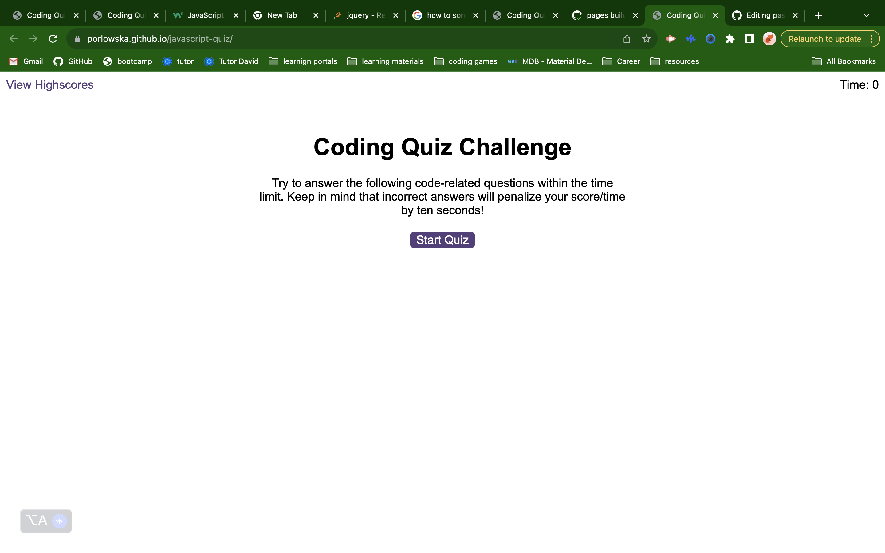
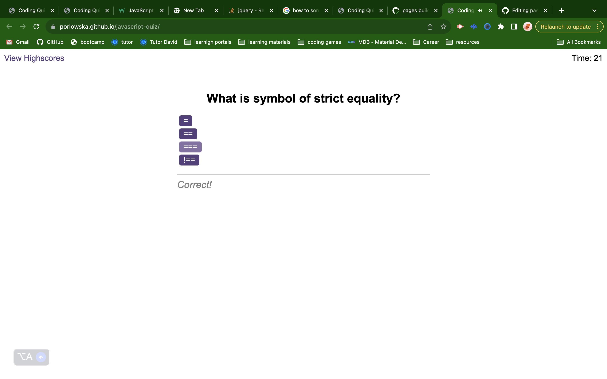

# JavaScript Quiz

## Description

This application is  timed coding quiz with multiple-choice questions. This app runs in the browser, and features dynamically updated HTML and CSS powered by JavaScript.

## Installation

This app runs in the browser, and features dynamically updated HTML and CSS powered by JavaScript.

To access the password generator please [follow the link](https://porlowska.github.io/javascript-quiz/). 

Then press "START" button.

## Usage

This app can be used by Bootcamp Students to check they knowleadge of JavaScript while haveing fun and trying to beat their high score.

 

## Credits

N/A

## License

MIT Licence
